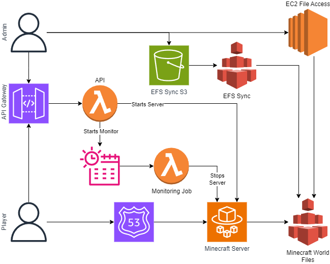

# Intro
Multiplayer Minecraft hosted with AWS ECS Fargate, and utilizing AWS Lambda for managing the server.

This is not at the point where it is an easy setup. Technical knowledge will be required to set it up and maintain it. While this utilizes AWS Fargate to minimize costs, you are altimetry responsible for managing cost of your AWS resources and properly deprovisioning AWS resources when no longer in use. It is also your responsibility to ensure data and endpoint security.

# Architecture

# Requirements
- AWS Knowledge
  - Cloud Formation
  - IAM
  - EC2 / EFS
  - API Gateway
  - Route 53
- AWS Account
- Python 3.10+
- Domain for hosting

# Setup
1. Create a bucket called [LowercaseName]-efs-sync-bucket-[AWS::AccountId] // LowercaseName is a parameter for the stack.
2. Copy Lambda files into bucket.
3. Deploy Stack.

# Some Screws Not Included
You will need to develop a way for your players to access the endpoint to launch the server. There is a IAM User created which has that permission to invoke the API, but it is pest to not give users direct AWS access. Personally, I created a Discord bot that exposed slash commands which used the IAM User to make the API calls.

Suggested, set up a way to connect directly to EFS so you can make changes directly to the world files (whitelist, mods, resource packs). You can do this by mounting the EFS volume to an EC2 instance that you are able to SSH into and is only running when you need that access.

# Future Improvements
- API endpoint to stop the server.
- Save a backup of the world to S3 on server shut down.
- API endpoint to get the current number of players.
- Use FTP to transfer server files
- Build lambda jobs into release with GHA

# Disclaimer and Indemnification
By using the code, templates, or any other content provided in this repo ("Repo"), you ("User") agree to indemnify and hold harmless the repo owner and any contributors from any claims, damages, or expenses arising from the User's use or misuse of this Repo.
